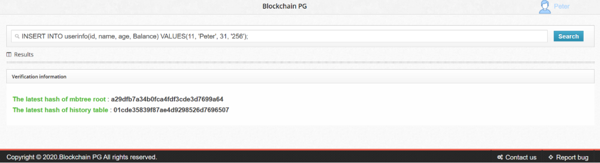
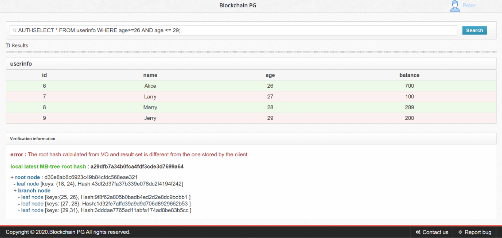
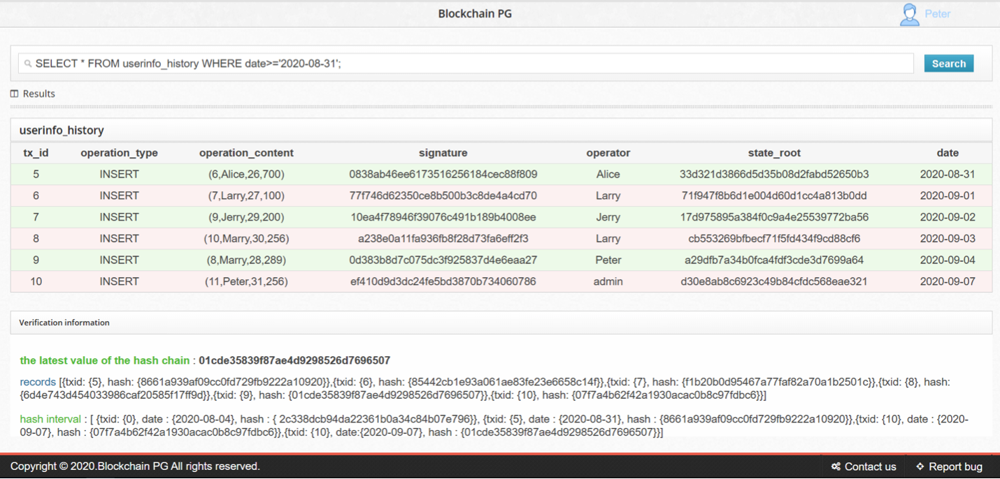

# Blockchain PG: Enabling Authenticated Query and Trace Query in Database

Blockchain PG, a novel data management system built on a legacy system. The system architecture applies to most databases system. By establishing a trusted relationship between the database and the client, Blockchain PG not only guarantees that the existing legacy system will not be greatly affected, but also achieves the data integrity and correctness by authenticated query, and the traceability of data by trace query.

For more details:

[《 Blockchain PG: Enabling Authenticated Query and Trace Query in Database (APWeb-WAIM 2020) 》][pg]

[pg]: https://dl.acm.org/doi/abs/10.1007/978-3-030-60290-1_41

### Dependencies

------

- **Linux**
  - Upgrade your gcc to version at least 4.8 to get C++11 support.

### Source code layout

------

The Blockchain PG root directory is based on original postgres, our modification is made in  `src`.

Inside the `src` directory are the following important directories:

- `executor`: contains the implementation of Blockchain PG;
- `storage`: contains the implementation of Blockchain PG;
- `include/mbt`: contains header files of MBT.
- `backend/mbt`: contains the implementation of MBT.

### Using

------

Run `compile.sh` to generate executable file, the using of Blockchain PG is same as original postgresql, you can refer to [postgresql's docs][doc].

[doc]: https://www.postgresql.org/docs/

Blockchain PG support authenticated query and trace query to achieves integrity, correctness and traceability of data.

#### Authenticated query case:

* Insert operation:

* Authenticated query:

#### Trace query case:

* Trace query:

